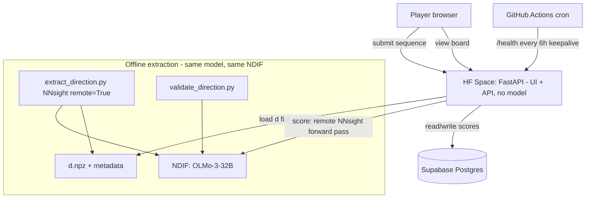

# Pro-Human Activation-Steering Competition — Build Spec

> **Purpose of this document.** This is the single source of truth for building the competition. Hand it to Claude Code and build phase by phase (see §13). It encodes the architecture, the scoring math, the data model, the API contract, the deploy story, and the constraints (notably: **$0 budget**). When something is ambiguous, prefer the simplest option that keeps the whole stack free and self-hostable.

---

## 0. TL;DR for the agent

- Build a public web leaderboard where players submit **short token sequences**. The server scores each sequence by **how much it pushes a frozen large language model's internal activations along a fixed "pro-human" direction `d`**, then ranks it.
- League type: **server-scored oracle** — `d` and the model are public, but the served model (**OLMo-3-32B**) is far too large for players to run locally, so the **server is the canonical scoring oracle**. Players submit the sequences they believe steer the model's state hardest along `d`; the server scores each on NDIF and ranks it. (`d` stays public, so it's optimization-in-spirit; oracle-in-practice.)
- **The server holds the maintainer's NDIF key.** Scoring runs as a remote NNsight forward pass on NDIF — the HF Space loads **no model of its own**. This is a deliberate, access-authorized exception to "never put NDIF in the request loop" (see §4, §11.5): the maintainer has Northeastern NDIF research access, the project is non-commercial research, and traffic is expected to be low.
- Stack, all free: **Hugging Face Space (free CPU, 2 vCPU / 16 GB)** hosts the UI + API (no model in memory); **NDIF + NNsight** run the 32B forward passes for both extraction and live scoring; **Supabase free Postgres** holds the leaderboard; **GitHub + GitHub Actions** hold the repo and a keepalive cron; `d` ships as a small file in the repo.
- Because every submission spends the maintainer's NDIF quota, **rate-limiting + a small server-side queue are load-bearing**, not just anti-abuse. If the project ever outgrows pilot NDIF (e.g. becomes popular), the fallback is to request dedicated university/compute resources — not to pay.

---

## 1. Concept and glossary

| Term | Meaning |
|---|---|
| **Direction `d`** | A single vector in the model's residual-stream space representing "pro-human." Computed offline from contrastive pairs; frozen for a season. |
| **`d̂`** | Unit-normalized `d` (`d / ‖d‖`). |
| **Contrastive pair** | `{axis, prompt, chosen, rejected}` — a prompt with a pro-human (`chosen`) and anti-human (`rejected`) completion. |
| **Axis** | One of 15 human-values dimensions (accountability, boundaries, conflict_resolution, empathy, fairness, feedback, inclusion, integrity, leadership, learning, ownership, privacy, respect, safety, trust). |
| **Residual stream `R_L(x)`** | Hidden activations at the output of transformer layer `L` for input `x`. We read the **last-token** position by default. |
| **Score** | How far a submitted sequence shifts activations along `d̂` (see §5). Positive = pro-human. |
| **Season** | A frozen `(model_id, layer, d_version, scoring_config)` tuple. Scores are only comparable **within** a season. |
| **Token budget** | Max number of tokens a submitted sequence may have (model-specific tokenization). |

---

## 2. Non-negotiable constraints

1. **$0 forever.** No paid hardware, no paid tiers, no trial credits that expire. NDIF is free via the maintainer's Northeastern research access. If anything would ever cost money, stop and reconsider the component (or request university compute) — never pay.
2. **Determinism (best-effort, NDIF-bounded).** A given `(sequence, season)` should always produce the **same** score *while NDIF serves the same model build*. No sampling (we never generate; only forward passes). Reproducibility is bounded by NDIF's serving of the model — see §5.4 and §14.
3. **Server is the authority.** Never trust a client-reported score. The server scores every submission via NDIF and that value is canonical.
4. **NDIF in the live loop (deliberate, authorized).** Live scoring is a remote NNsight forward pass on NDIF using the maintainer's server-side key; the HF Space runs **no model locally**. This overrides the earlier "small CPU model" design — justified by authorized non-commercial research access and low expected traffic. The Space stays light (UI + API only).
5. **No browser storage** in any frontend code. Keep state server-side (Supabase) or in-memory.
6. **Protect the NDIF quota.** Every submission consumes the maintainer's quota, so strict rate-limiting and a small server-side request queue are mandatory, not optional.

---

## 3. Architecture



- **One HF Docker Space** serves the JSON API + static frontend. Free CPU Basic tier (2 vCPU, 16 GB, non-persistent disk). It **sleeps after ~48 h idle**; the GitHub Actions cron pings `/health` to keep it warm. It loads **only the `d` file** at startup — no model weights.
- **NDIF** serves **OLMo-3-32B** and runs every scoring forward pass via NNsight `remote=True`, authenticated with the maintainer's server-side key. The **same NDIF model** is used offline to extract and validate `d`, so extraction and scoring share one activation space (no cross-size mismatch).
- **Supabase** (free Postgres) stores seasons + submissions. The Space disk is non-persistent, so **nothing durable lives on the Space** — all state is in Supabase.
- **`d`** is a small committed file (the 32B's hidden dim → a few hundred KB), loaded once at startup.
- A small **server-side queue + rate limiter** sits in front of the NDIF calls to bound quota usage and absorb bursts.

### Fallback if pilot NDIF becomes insufficient
If the project gets popular enough to strain pilot NDIF quota/latency, **request dedicated university compute** (Northeastern research resources) or a dedicated NDIF allocation — do not move to a paid tier. As a hosting fallback (e.g. if the HF Space's 48 h sleep is a problem), Oracle Cloud **Always Free** ARM VM (4 OCPU / 24 GB, no sleep) can host FastAPI behind Caddy; it would still call NDIF for scoring. Treat either as a v2 migration, not the starting point.

---

## 4. Model and direction `d`

### 4.1 Live-scoring model
- **`OLMo-3-32B`, served by NDIF** (an NDIF "Warm" model → fastest big-model response). Both extraction and live scoring run on this same NDIF-hosted model via NNsight `remote=True`. Confirm the exact NDIF-hosted model id/string against the current NDIF model list before pinning it into a season; the app must treat the model id as config (env / season row), not a hard-coded constant.
- The HF Space loads **no model weights** — it only ships the `d` file and calls NDIF. So there is no CPU/RAM model-size constraint on the Space.
- NNsight calls are forward-pass only (no generation): no sampling, no dropout. Pin `nnsight`, `transformers`, and `torch` versions in `requirements.txt`. Determinism is bounded by NDIF's serving of the model (§5.4).
- If 32B latency/quota proves painful, `OLMo-2-7B` (also NDIF "Warm") is a drop-in lighter alternative — it's just a different season (new `d`, new `model_id`).

### 4.2 The direction file
Ship `data/directions/d_<version>.npz` containing:
- `d`: float32 vector of length d_model.
- metadata: `model_id`, `layer`, `d_version`, `extraction_method`, `confounds_removed`, `created_at`, `notes`.

### 4.3 Versioning rule (critical)
A leaderboard is only meaningful within a fixed `(model_id, layer, d_version)`. Every time `d` is recomputed (e.g., after cleaning seed pairs), bump `d_version` and **start a new season**. Old scores stay attached to their old season and are never mixed in.

---

## 5. Scoring (the heart of the system)

Let `R_L(x)[-1]` be the layer-`L` residual stream at the last token of input `x`, and `d̂ = d/‖d‖`.

### 5.1 Default metric — cosine steering-shift
The project goal is "push the model's activations toward `d`," so we measure the **induced shift** the candidate sequence causes on a fixed set of neutral probe prompts, not the sequence's own embedding.

Given a fixed **probe set** `P` (a small, committed list of neutral prompts, e.g. 16 of them):

```
score(seq) = mean over p in P of [ cos(R_L(seq ⊕ p)[-1], d) − cos(R_L(p)[-1], d) ]
```

- `seq ⊕ p` = the candidate sequence **prepended** to probe `p`.
- `cos(·, d)` is cosine similarity with `d` (normalized — this resists trivial "blow up the activation norm" gaming).
- Positive score ⇒ the sequence pushes the readout pro-human; negative ⇒ anti-human.
- The probe set is frozen per season and shipped in the repo (`data/probes/<season>.json`).

### 5.2 Simpler fallback — self-activation score
If you want a v0 without probes:
```
score(seq) = cos(R_L(seq)[-1], d)
```
Easier, but measures "does this string look pro-human internally" rather than "does it steer," and is easier to game. Use only for an initial smoke test.

### 5.3 Anti-gaming rules baked into scoring
- **Cosine, not raw projection** → norm inflation gives no advantage.
- **Token budget** (`TOKEN_BUDGET`, default 10) enforced on the tokenized submission; reject longer.
- **Exact + near-duplicate rejection**: a normalized (lowercased, whitespace-collapsed) submission identical to an existing higher- or equal-scoring entry by anyone is rejected; optionally reject trivial near-dups.
- **Canonical re-score**: server always recomputes; client scores are display-only hints at best.
- Optional **fluency sub-league** (stretch): require the sequence to pass a simple perplexity threshold under the same model, for a "human-readable" board alongside the "anything goes" board.

### 5.4 Determinism requirements (NDIF-bounded)
- Forward-pass only: no sampling, no generation, no dropout.
- Fixed tokenizer + fixed special-token handling (decide once whether BOS is prepended; document it).
- Pin the NDIF model id/build per season; record it in the season row + `d` metadata. Scores are reproducible **only while NDIF serves that same build** — if NDIF re-serves or updates the model, treat it as a potential season break (re-validate; if scores shift materially, open a new season).
- Unit test: scoring the same sequence twice (and after an app reload) yields near-identical scores (assert within a tolerance, e.g. 1e-4; allow a little slack for remote/float variation rather than demanding bitwise equality).
- Cache scores by `(season_id, norm_key)` in Supabase so a repeat of an already-scored sequence is served from the DB, not re-sent to NDIF (saves quota and sidesteps minor remote drift).

---

## 6. Data model (Supabase Postgres)

```sql
create table seasons (
  id            bigint generated always as identity primary key,
  name          text not null,
  model_id      text not null,           -- NDIF-hosted model id/string
  model_build   text,                    -- NDIF build/revision id if exposed (season reproducibility)
  layer         int  not null,
  d_version     text not null,
  scoring_mode  text not null default 'cosine_steering_shift', -- or 'cosine_self'
  token_budget  int  not null default 10,
  probe_set_id  text,
  active        boolean not null default true,
  created_at    timestamptz not null default now(),
  unique (model_id, layer, d_version)
);

create table submissions (
  id            bigint generated always as identity primary key,
  season_id     bigint not null references seasons(id),
  user_handle   text not null,
  sequence_text text not null,
  norm_key      text not null,            -- normalized form for dedup
  token_count   int  not null,
  score         double precision not null,
  ip_hash       text,                     -- salted hash, for rate-limit + abuse only
  created_at    timestamptz not null default now()
);

create index on submissions (season_id, score desc);
create unique index on submissions (season_id, norm_key); -- one canonical entry per unique sequence per season

-- Leaderboard read:
-- select user_handle, sequence_text, score, created_at
-- from submissions where season_id = $1 order by score desc limit $2;
```

Notes:
- Store **one row per unique sequence per season** (the unique index). A new submission of an existing sequence is rejected as a duplicate.
- `ip_hash` is a salted SHA-256 of the IP, used only for rate-limiting and abuse detection. Never store raw IPs.
- Keep PII out: `user_handle` is a free-text display name, not an account, in v1.

---

## 7. Backend API (FastAPI)

All JSON. Mounted in the same app that serves the frontend.

### `GET /health`
→ `200 {"status":"ok","season":<id>,"model":<model_id>}`. Used by the keepalive cron.

### `GET /season`
→ current active season config the frontend needs:
```json
{ "id": 1, "name": "Season 1 — OLMo-3-32B", "model_id": "OLMo-3-32B",
  "layer": 16, "d_version": "v1", "token_budget": 10, "scoring_mode": "cosine_steering_shift" }
```

### `GET /leaderboard?season=<id>&limit=<n>`
→ top `n` (default 50, max 200):
```json
{ "season": 1, "entries": [ { "rank":1, "handle":"alice", "sequence":"...", "score":0.83, "at":"..." } ] }
```

### `POST /submit`
Body: `{ "handle": "alice", "sequence": "..." }`
Pipeline:
1. Validate handle (1–32 chars, safe charset) and sequence (non-empty, ≤ some char cap before tokenizing).
2. Tokenize; reject if `token_count > TOKEN_BUDGET`.
3. Compute `norm_key`; reject if it already exists for this season (duplicate).
4. Rate-limit by `ip_hash` (see §9). Reject 429 if exceeded. **This also protects the shared NDIF quota.**
5. **Score canonically** (§5): score is served from the `(season_id, norm_key)` cache if present; otherwise enqueued and computed via a remote NNsight forward pass on NDIF. Bound concurrency with the server-side queue so bursts don't exceed NDIF limits; surface a clear "scoring…" / retry message if the queue is saturated or NDIF is unavailable (502/503).
6. Insert; compute rank (`count(*) where score > this`).
7. → `200 {"score":0.71,"rank":12,"token_count":7}` or appropriate 4xx/5xx with a clear message.

Validation/errors must be friendly strings the UI can show directly.

---

## 8. Frontend

**Stack: plain HTML + CSS + vanilla JS, with Alpine.js for reactivity** (one `<script>` CDN tag — no build step, no Node toolchain). FastAPI serves it as static assets. No React/Next, no bundler. Alpine handles the reactive bits (live token counter, form submit state, leaderboard refresh) declaratively over the JSON endpoints; drop to plain `fetch` where simpler. (htmx is an acceptable alternative, but Alpine fits client-side reactivity over JSON better than htmx's HTML-swap model.)

Rationale: the v1 surface is small (banner + form + table + rules) and this keeps the single-Space deploy trivial. The frontend is fully decoupled from the JSON API, so migrating to a React static build later (if the Phase 6 multi-leaderboard features land) is cheap.

Must have:
- **Season banner**: model, layer, `d_version`, token budget, scoring mode, link to rules.
- **Submission form**: handle + sequence + Submit. Live token counter (call a `/tokenize` helper or count client-side approximately and let the server be authoritative). Show returned score + rank + friendly errors.
- **Leaderboard table**: rank, handle, sequence, score, time. Auto-refresh or manual refresh. Top entries highlighted.
- **Rules / how-it-works** section: explain the optimization league, that `d` and the model are public, the token budget, that weird/opaque sequences are allowed (and on-theme), and the dedup rule.
- No login in v1. No browser storage. Mobile-friendly.

Design: clean, single accent color, monospace for the sequence column. If using the `frontend-design` skill, follow its tokens; keep it lightweight (no heavy framework needed).

---

## 9. Security / anti-abuse

- **Rate limit** per `ip_hash`: e.g. 30/min and 500/day (tune later). This is **load-bearing** — it's the throttle on the maintainer's shared NDIF quota, not just anti-abuse. Implement with a small Postgres counter or an in-memory token bucket (acceptable given single-instance Space). Consider a stricter global cap (all users combined) as a hard ceiling on NDIF spend per day.
- **Server-side scoring queue**: bound concurrent NDIF calls (e.g. a small worker pool / semaphore) so a burst of submissions can't exceed NDIF concurrency limits or stall the Space. Cache `(season_id, norm_key)` scores so repeats never re-hit NDIF.
- **Protect the NDIF key**: `NDIF_API_KEY` lives only in Space secrets / server env — never in client JS, the repo, or any response. All NDIF calls are server-side.
- **CAPTCHA** (recommended given the quota stakes): Cloudflare Turnstile or hCaptcha (both free) on submit to stop bot floods that would drain NDIF quota.
- **Input hardening**: cap raw sequence length before tokenizing (e.g. 500 chars) to avoid pathological inputs; strip control characters; reject non-UTF-8.
- **Secrets** via Space secrets / env: `SUPABASE_URL`, `SUPABASE_SERVICE_KEY` (server-side only), `IP_HASH_SALT`, `NDIF_API_KEY`. Never ship keys in the repo.
- **CORS**: lock to the Space's own origin.

---

## 10. Repo structure

```
.
├── README.md                  # HF Space frontmatter + project blurb
├── PROJECT_SPEC.md            # this document
├── requirements.txt           # pinned: nnsight, torch (cpu), transformers, fastapi, uvicorn, supabase, numpy, slowapi
├── Dockerfile
├── app/
│   ├── main.py                # FastAPI app: routes, startup (load d + init NDIF client), static mount
│   ├── scoring.py             # cosine steering-shift via remote NNsight forward pass on NDIF (§5)
│   ├── ndif_client.py         # NNsight LanguageModel(remote=True) + tokenizer; holds NDIF key; NO local weights
│   ├── queue.py               # bounded scoring queue / semaphore around NDIF calls
│   ├── db.py                  # Supabase client + queries (incl. (season_id, norm_key) score cache)
│   ├── ratelimit.py           # per-ip + global daily ceiling (NDIF quota guard)
│   └── config.py              # reads season config + env
├── data/
│   ├── directions/d_v1.npz    # committed direction + metadata
│   ├── probes/season1.json    # fixed probe set
│   └── seed_pairs.jsonl       # contrastive pairs (cleaned; see §11)
├── web/                       # plain HTML/CSS/JS + Alpine.js (CDN); no build step
│   ├── index.html
│   ├── app.js
│   └── styles.css
├── scripts/                   # OFFLINE ONLY — not run by the Space
│   ├── extract_direction.py   # NNsight; difference-of-means / LDA + orthogonalization
│   ├── validate_direction.py  # held-out separation, confound cosines, causal steering check
│   └── clean_seed_pairs.py    # length-match / de-caricature helpers, encoding-bug scan
├── tests/
│   ├── test_scoring_determinism.py
│   └── test_submit_flow.py
└── .github/workflows/
    └── keepalive.yml          # cron: curl /health every 6h
```

---

## 11. Seed pairs and `d` extraction (offline)

### 11.1 Data format
`data/seed_pairs.jsonl`, one object per line: `{"axis": "...", "prompt": "...", "chosen": "...", "rejected": "..."}`. 15 axes, ~20 pairs each.

### 11.2 Known issues in the current pairs — fix before extracting
1. **Length/structure confound** (biggest): `chosen` are long triadic "X, Y, and Z" clauses; `rejected` are short single clauses. **Rewrite `rejected` to match `chosen` in length and structure** (also expressing the anti-human choice), so `d` isn't dominated by "length/list-iness."
2. **Register confound**: HR-handbook vocabulary clusters on `chosen`. Length-matching + de-caricaturing reduces this.
3. **Caricatured negatives**: make `rejected` plausible and competent-sounding, not cartoonish.
4. **Domain skew**: ~95% workplace scenarios. Add personal/civic/online scenarios so `d` isn't just "workplace professionalism."
5. **Encoding bug**: at least one `chosen` (integrity axis) contains an Arabic word (`رفض`) instead of English. `clean_seed_pairs.py` must scan for and flag non-ASCII leaks.

### 11.3 Extraction recipe (`extract_direction.py`)
1. Read activations at the **last token** (or a forced-choice decision token), **not** mean-pooled (mean-pooling bakes in the length artifact).
2. Compute **per-pair differences** `δ_i = R_L(chosen_i)[-1] − R_L(rejected_i)[-1]` (cancels prompt/topic).
3. Estimate `d` by either **mean of δ** (mass-mean) or **LDA / whitened mean-diff** `Σ_within⁻¹ (μ_chosen − μ_rejected)` with shrinkage (down-weights high-variance style noise), or a **logistic probe on δ** (max-margin, preference-aware).
4. **Orthogonalize** `d` against explicit confound directions: build a `length` direction (long vs short neutral text) and a `sentiment` direction (pos vs neg neutral text), then project them out (Gram-Schmidt) — or use LEACE for proper concept erasure.
5. Save `d_<version>.npz` with metadata.

### 11.4 Validation (`validate_direction.py`) — run before shipping a `d`
- **Held-out separation**: hold out ~20% of pairs per axis; confirm `d` separates them.
- **Confound cosines**: `cos(d, length_dir)` and `cos(d, sentiment_dir)` should be near zero after orthogonalization.
- **Causal steering check**: add `α·d` to layer `L` output and confirm generations shift toward the value as expected. If behavior doesn't move, `d` is bad — no scoring config rescues it.
- **Per-axis coherence**: compute the 15 per-axis directions; check they cluster (point the same way). If they don't, a single "pro-human" `d` may not exist in this model — itself a useful finding.

### 11.5 NNsight / NDIF usage
- Use **NNsight** for all activation grabs, scoring, and the causal steering check — its intervention-graph idiom is cleaner than raw hooks (`with model.trace(...): h = model.<layer>.output[0].save()`).
- Extract/validate `d` on **OLMo-3-32B via NDIF** (`remote=True`) for free, no local GPU. NDIF hosts OLMo-2 (7B/13B), OLMo-3 (7B/32B), OLMoE, etc., all **Pilot Only**. The maintainer has Northeastern NDIF research access. NDIF "Warm" models (OLMo-2-7B, OLMo-3-32B) respond fastest — prefer those.
- **NDIF is in the live loop here, by design** — this is the deliberate, access-authorized exception to NDIF's usual "research-only" guidance (see §0 and §2 constraint #4). It is justified only because: access is legitimate (Northeastern), the project is non-commercial research, traffic is low, and the server caches + rate-limits + queues every call to bound quota use. If those stop being true, move to dedicated university compute (§3 fallback), not a paid tier.
- **Extraction and live scoring use the same NDIF model**, so there is no cross-model-size mismatch — `d` lives in exactly the activation space it's scored in. (The "re-extract on the served model" caveat only mattered when serving a *different, smaller* model; it doesn't apply now.)
- Score caching is critical: never re-send an already-scored `(season_id, norm_key)` to NDIF.

---

## 12. Configuration defaults

```python
# app/config.py defaults — override via env / season row
MODEL_ID        = "OLMo-3-32B"  # confirm exact NDIF-hosted id/string before pinning
MODEL_BUILD     = ""            # NDIF build/revision id if exposed (season reproducibility)
LAYER           = 16            # sweep during extraction; pick best held-out separation (range depends on the 32B's depth)
TOKEN_BUDGET    = 10
SCORING_MODE    = "cosine_steering_shift"
PROBE_SET       = "data/probes/season1.json"   # ~16 neutral prompts, frozen
D_FILE          = "data/directions/d_v1.npz"
PREPEND_BOS     = True          # document and keep fixed
# NDIF / scoring
NDIF_API_KEY    = "<from env / Space secret — server-side only>"
NDIF_TIMEOUT_S  = 60            # per remote forward pass
SCORE_CONCURRENCY = 2           # server-side queue: max concurrent NDIF calls
# Rate limits (load-bearing: these cap NDIF quota usage)
RATE_PER_MIN    = 30
RATE_PER_DAY    = 500
GLOBAL_PER_DAY  = 5000          # hard ceiling on total NDIF scoring calls/day across all users
LEADERBOARD_MAX = 200
```
Note: `DTYPE` is dropped — the model runs on NDIF, not locally, so the Space doesn't control its dtype.

---

## 13. Build plan (do in order)

**Phase 0 — Scaffold.** Repo tree (§10), `requirements.txt` pinned, `config.py`, `.env.example`, README with HF Space frontmatter. Acceptance: `uvicorn app.main:app` boots locally and `/health` returns ok with a stub season.

**Phase 1 — Scoring core.** `ndif_client.py` (NNsight `LanguageModel(remote=True)` + tokenizer, NDIF key from env), `scoring.py` (cosine steering-shift via remote forward pass, §5), ship a placeholder `d_v1.npz` and `season1.json` probes. (Use a small local model to develop offline if NDIF is slow, but the seasoned path is NDIF.) Tests: determinism (`test_scoring_determinism.py`) — same sequence → same score across two calls and a reload, within tolerance (≤1e-4). Acceptance: a CLI `python -m app.scoring "be honest and own mistakes"` prints a score (hitting NDIF).

**Phase 2 — API + DB.** Supabase schema (§6) via a migration SQL file; `db.py` client (incl. `(season_id, norm_key)` score cache); `queue.py` bounded NDIF concurrency; implement `/season`, `/leaderboard`, `/submit` with validation, dedup, rate limit + global daily ceiling (§7, §9). Tests: full submit flow incl. duplicate rejection, token-budget rejection, cache hit (no NDIF re-call), and rate-limit 429. Acceptance: can submit and read back a ranked board against a real free Supabase project.

**Phase 3 — Frontend.** `web/` page (§8): season banner, form with token counter, leaderboard table, rules. Acceptance: end-to-end submit + see yourself ranked, mobile-friendly, friendly errors.

**Phase 4 — Deploy.** Dockerfile (no model download — just the app; port 7860), README frontmatter (`sdk: docker`, `app_port: 7860`), Space secrets wired (incl. `NDIF_API_KEY`). `keepalive.yml` GitHub Action hitting `/health` every 6 h. Acceptance: public Space URL works; survives a cold start; cron keeps it warm; a real submission scores through NDIF.

**Phase 5 — Real direction.** Clean seed pairs (§11.2) via `clean_seed_pairs.py`; `extract_direction.py` (§11.3) on **OLMo-3-32B via NDIF**; `validate_direction.py` (§11.4) all green; commit the real `d_v1.npz`; open Season 1 (model id/build pinned in the season row). Acceptance: validation report shows good held-out separation and near-zero confound cosines; causal steering check passes.

**Phase 6 — Stretch (optional).**
- Per-axis leaderboards (15 directions) and an **anti-human** board per axis (push away from `d`).
- **Weight-class tiers**: a second season on a lighter NDIF model (e.g. OLMo-2-7B / OLMo-3-7B) for faster/cheaper scoring.
- **Fluency sub-league** (perplexity-gated "human-readable" board).
- **SAE-feature direction** for an interpretable flagship (if an SAE exists for the model/layer): define `d` from value-laden monosemantic features; show players which features their sequence lit up.
- **Hidden-oracle exploration league** (different game): hide `d`, expose only a rate-limited scoring oracle, rotate/hold-out axes — rewards human intuition over local optimization.

---

## 14. Determinism & reproducibility checklist (must pass before launch)

- [ ] NDIF model id/build pinned per season and recorded in the season row + `d` metadata; forward-pass only (no sampling/generation).
- [ ] Tokenizer behavior (BOS, special tokens) fixed and documented.
- [ ] Scoring is reproducible within tolerance (e.g. 1e-4) across app reloads **while NDIF serves the same build**; `(season_id, norm_key)` score cache in place so repeats don't re-hit NDIF.
- [ ] Documented season-break policy: if NDIF re-serves/updates the model and scores shift materially, open a new season.
- [ ] `NDIF_API_KEY` server-side only (Space secret); never in client JS, repo, or responses.
- [ ] `d` file metadata records `(model_id, layer, d_version, method, confounds_removed)`.
- [ ] Season row matches the `d` file exactly; leaderboard queries always filter by `season_id`.
- [ ] Rate limits + global daily ceiling + scoring queue active (NDIF quota protection).
- [ ] No browser storage anywhere; all durable state in Supabase.

---

## 15. Cost ledger (must stay all-zero)

| Component | Service | Tier | Cost |
|---|---|---|---|
| UI + API host (no model) | Hugging Face Space | CPU Basic (2 vCPU / 16 GB) | $0 |
| Leaderboard DB | Supabase | Free Postgres | $0 |
| Repo + CI + keepalive | GitHub + Actions | Free | $0 |
| Model + scoring + extraction | NDIF + NNsight (OLMo-3-32B) | Free — Northeastern research/pilot access | $0 |
| Domain | `*.hf.space` provided | Free | $0 |

The 32B model runs entirely on NDIF, so there are no model-weight downloads or GPU costs on the maintainer's side. If pilot NDIF ever becomes insufficient (popularity, quota), the fallback is **dedicated university compute / a larger NDIF allocation**, not a paid tier. If any line item ever requires payment, stop and reconsider that component rather than paying.
