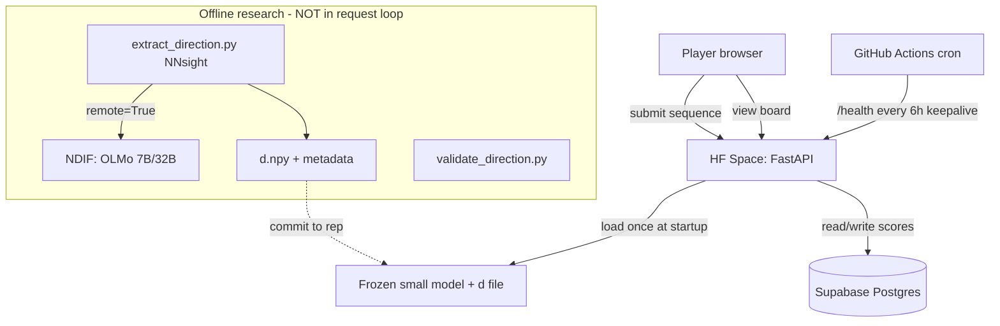

# Pro-Human Activation-Steering Competition — Build Spec

> **Purpose of this document.** This is the single source of truth for building the competition. Hand it to Claude Code and build phase by phase (see §13). It encodes the architecture, the scoring math, the data model, the API contract, the deploy story, and the constraints (notably: **$0 budget**). When something is ambiguous, prefer the simplest option that keeps the whole stack free and self-hostable.

---

## 0. TL;DR for the agent

- Build a public web leaderboard where players submit **short token sequences**. The server scores each sequence by **how much it pushes a frozen language model's internal activations along a fixed "pro-human" direction `d`**, then ranks it.
- League type: **optimization** — `d`, the model, and the scoring function are all public. Players optimize locally and submit their best sequence; the server's only job is to **re-score each submission canonically** (one forward pass) and rank it. This keeps server load light and lets the whole thing run on free CPU.
- Stack, all free: **Hugging Face Space (free CPU, 2 vCPU / 16 GB)** hosts the scorer + UI; **Supabase free Postgres** holds the leaderboard; **GitHub + GitHub Actions** hold the repo and a keepalive cron; the model is **a small open model run on CPU**; `d` ships as a small file in the repo.
- The model for **live scoring must be small** (Pythia-410M class) because that's what runs on free CPU. Bigger models (OLMo-2-7B / OLMo-3-32B) are used only for **offline research/extraction** via NDIF + NNsight — never in the live request loop.

---

## 1. Concept and glossary

| Term | Meaning |
|---|---|
| **Direction `d`** | A single vector in the model's residual-stream space representing "pro-human." Computed offline from contrastive pairs; frozen for a season. |
| **`d̂`** | Unit-normalized `d` (`d / ‖d‖`). |
| **Contrastive pair** | `{axis, prompt, chosen, rejected}` — a prompt with a pro-human (`chosen`) and anti-human (`rejected`) completion. |
| **Axis** | One of 15 human-values dimensions (accountability, boundaries, conflict_resolution, empathy, fairness, feedback, inclusion, integrity, leadership, learning, ownership, privacy, respect, safety, trust). |
| **Residual stream `R_L(x)`** | Hidden activations at the output of transformer layer `L` for input `x`. We read the **last-token** position by default. |
| **Score** | How far a submitted sequence shifts activations along `d̂` (see §5). Positive = pro-human. |
| **Season** | A frozen `(model_id, layer, d_version, scoring_config)` tuple. Scores are only comparable **within** a season. |
| **Token budget** | Max number of tokens a submitted sequence may have (model-specific tokenization). |

---

## 2. Non-negotiable constraints

1. **$0 forever.** No paid hardware, no paid tiers, no trial credits that expire. Every component must have a genuinely free, indefinite tier.
2. **Determinism.** A given `(sequence, season)` must always produce the **same** score. Fixed model, fixed dtype, eval mode, fixed tokenizer, no sampling (we never generate; we only run forward passes).
3. **Server is the authority.** Never trust a client-reported score. The server re-scores every submission and that value is canonical.
4. **Small model in the live loop.** The hosted scorer must comfortably run on 2 vCPU / 16 GB CPU. Default: `EleutherAI/pythia-410m`.
5. **No browser storage** in any frontend code. Keep state server-side (Supabase) or in-memory.

---

## 3. Architecture



- **One HF Docker Space** serves both the JSON API and the static frontend. Free CPU Basic tier (2 vCPU, 16 GB RAM, 50 GB non-persistent disk). It **sleeps after ~48 h of inactivity**; the GitHub Actions cron pings `/health` to keep it warm.
- **Supabase** (free Postgres) stores seasons + submissions. The Space disk is non-persistent, so **nothing durable lives on the Space** — all state is in Supabase.
- **Model + `d`** are loaded once at startup and held in memory. `d` is a small committed file.
- The **offline subgraph** (extraction + validation) is a separate set of scripts run on the maintainer's machine; its only output that touches production is the committed `d` file.

### Alternative hosting (only if the 48 h sleep or CPU limits bite)
Oracle Cloud **Always Free** ARM VM (4 OCPU / 24 GB RAM, never expires, no sleep). Run FastAPI + SQLite + model behind Caddy (auto-HTTPS). Caveats: credit-card identity check at signup, ARM/aarch64 builds, frequent "Out of Capacity" in popular regions, idle-reclamation (keep CPU > 20% p95 over 7 days via a tiny cron). Treat as a v2 migration, not the starting point.

---

## 4. Model and direction `d`

### 4.1 Live-scoring model
- Default: `EleutherAI/pythia-410m` (24 layers, d_model 1024). Loads fast, runs single forward passes on CPU in well under a second, excellent TransformerLens/NNsight support.
- Stay in the OLMo family if preferred: `allenai/OLMo-2-0425-1B` (run locally; not the 7B — that won't serve on free CPU).
- Load in **fp32**, `.eval()`, `torch.set_grad_enabled(False)`. Pin `transformers` and `torch` versions in `requirements.txt`.

### 4.2 The direction file
Ship `data/directions/d_<version>.npz` containing:
- `d`: float32 vector of length d_model.
- metadata: `model_id`, `layer`, `d_version`, `extraction_method`, `confounds_removed`, `created_at`, `notes`.

### 4.3 Versioning rule (critical)
A leaderboard is only meaningful within a fixed `(model_id, layer, d_version)`. Every time `d` is recomputed (e.g., after cleaning seed pairs), bump `d_version` and **start a new season**. Old scores stay attached to their old season and are never mixed in.

---

## 5. Scoring (the heart of the system)

Let `R_L(x)[-1]` be the layer-`L` residual stream at the last token of input `x`, and `d̂ = d/‖d‖`.

### 5.1 Default metric — cosine steering-shift
The project goal is "push the model's activations toward `d`," so we measure the **induced shift** the candidate sequence causes on a fixed set of neutral probe prompts, not the sequence's own embedding.

Given a fixed **probe set** `P` (a small, committed list of neutral prompts, e.g. 16 of them):

```
score(seq) = mean over p in P of [ cos(R_L(seq ⊕ p)[-1], d) − cos(R_L(p)[-1], d) ]
```

- `seq ⊕ p` = the candidate sequence **prepended** to probe `p`.
- `cos(·, d)` is cosine similarity with `d` (normalized — this resists trivial "blow up the activation norm" gaming).
- Positive score ⇒ the sequence pushes the readout pro-human; negative ⇒ anti-human.
- The probe set is frozen per season and shipped in the repo (`data/probes/<season>.json`).

### 5.2 Simpler fallback — self-activation score
If you want a v0 without probes:
```
score(seq) = cos(R_L(seq)[-1], d)
```
Easier, but measures "does this string look pro-human internally" rather than "does it steer," and is easier to game. Use only for an initial smoke test.

### 5.3 Anti-gaming rules baked into scoring
- **Cosine, not raw projection** → norm inflation gives no advantage.
- **Token budget** (`TOKEN_BUDGET`, default 10) enforced on the tokenized submission; reject longer.
- **Exact + near-duplicate rejection**: a normalized (lowercased, whitespace-collapsed) submission identical to an existing higher- or equal-scoring entry by anyone is rejected; optionally reject trivial near-dups.
- **Canonical re-score**: server always recomputes; client scores are display-only hints at best.
- Optional **fluency sub-league** (stretch): require the sequence to pass a simple perplexity threshold under the same model, for a "human-readable" board alongside the "anything goes" board.

### 5.4 Determinism requirements
- fp32, `eval()`, no dropout, no sampling.
- Fixed tokenizer + fixed special-token handling (decide once whether BOS is prepended; document it).
- Fix `torch` threads if needed for reproducibility; document the exact `model_id` revision (pin the HF commit hash).
- Unit test: scoring the same sequence twice (and after a reload) yields bitwise-or-near-identical scores (assert within 1e-5).

---

## 6. Data model (Supabase Postgres)

```sql
create table seasons (
  id            bigint generated always as identity primary key,
  name          text not null,
  model_id      text not null,
  model_revision text not null,
  layer         int  not null,
  d_version     text not null,
  scoring_mode  text not null default 'cosine_steering_shift', -- or 'cosine_self'
  token_budget  int  not null default 10,
  probe_set_id  text,
  active        boolean not null default true,
  created_at    timestamptz not null default now(),
  unique (model_id, layer, d_version)
);

create table submissions (
  id            bigint generated always as identity primary key,
  season_id     bigint not null references seasons(id),
  user_handle   text not null,
  sequence_text text not null,
  norm_key      text not null,            -- normalized form for dedup
  token_count   int  not null,
  score         double precision not null,
  ip_hash       text,                     -- salted hash, for rate-limit + abuse only
  created_at    timestamptz not null default now()
);

create index on submissions (season_id, score desc);
create unique index on submissions (season_id, norm_key); -- one canonical entry per unique sequence per season

-- Leaderboard read:
-- select user_handle, sequence_text, score, created_at
-- from submissions where season_id = $1 order by score desc limit $2;
```

Notes:
- Store **one row per unique sequence per season** (the unique index). A new submission of an existing sequence is rejected as a duplicate.
- `ip_hash` is a salted SHA-256 of the IP, used only for rate-limiting and abuse detection. Never store raw IPs.
- Keep PII out: `user_handle` is a free-text display name, not an account, in v1.

---

## 7. Backend API (FastAPI)

All JSON. Mounted in the same app that serves the frontend.

### `GET /health`
→ `200 {"status":"ok","season":<id>,"model":<model_id>}`. Used by the keepalive cron.

### `GET /season`
→ current active season config the frontend needs:
```json
{ "id": 1, "name": "Season 1 — pythia-410m", "model_id": "EleutherAI/pythia-410m",
  "layer": 16, "d_version": "v1", "token_budget": 10, "scoring_mode": "cosine_steering_shift" }
```

### `GET /leaderboard?season=<id>&limit=<n>`
→ top `n` (default 50, max 200):
```json
{ "season": 1, "entries": [ { "rank":1, "handle":"alice", "sequence":"...", "score":0.83, "at":"..." } ] }
```

### `POST /submit`
Body: `{ "handle": "alice", "sequence": "..." }`
Pipeline:
1. Validate handle (1–32 chars, safe charset) and sequence (non-empty, ≤ some char cap before tokenizing).
2. Tokenize; reject if `token_count > TOKEN_BUDGET`.
3. Compute `norm_key`; reject if it already exists for this season (duplicate).
4. Rate-limit by `ip_hash` (see §9). Reject 429 if exceeded.
5. **Score canonically** (§5).
6. Insert; compute rank (`count(*) where score > this`).
7. → `200 {"score":0.71,"rank":12,"token_count":7}` or appropriate 4xx with a clear message.

Validation/errors must be friendly strings the UI can show directly.

---

## 8. Frontend

Single page, served as static assets by FastAPI (or Gradio for a faster v0 — but plain HTML/JS gives more control and a nicer look). Keep it one file or a tiny build.

Must have:
- **Season banner**: model, layer, `d_version`, token budget, scoring mode, link to rules.
- **Submission form**: handle + sequence + Submit. Live token counter (call a `/tokenize` helper or count client-side approximately and let the server be authoritative). Show returned score + rank + friendly errors.
- **Leaderboard table**: rank, handle, sequence, score, time. Auto-refresh or manual refresh. Top entries highlighted.
- **Rules / how-it-works** section: explain the optimization league, that `d` and the model are public, the token budget, that weird/opaque sequences are allowed (and on-theme), and the dedup rule.
- No login in v1. No browser storage. Mobile-friendly.

Design: clean, single accent color, monospace for the sequence column. If using the `frontend-design` skill, follow its tokens; keep it lightweight (no heavy framework needed).

---

## 9. Security / anti-abuse

- **Rate limit** per `ip_hash`: e.g. 30/min and 500/day (tune later). Implement with a small Postgres counter or an in-memory token bucket (acceptable given single-instance Space).
- **CAPTCHA** (optional v1.5): Cloudflare Turnstile or hCaptcha (both free) on submit to stop bot floods.
- **Input hardening**: cap raw sequence length before tokenizing (e.g. 500 chars) to avoid pathological inputs; strip control characters; reject non-UTF-8.
- **Secrets** via Space secrets / env: `SUPABASE_URL`, `SUPABASE_SERVICE_KEY` (server-side only), `IP_HASH_SALT`. Never ship keys in the repo.
- **CORS**: lock to the Space's own origin.

---

## 10. Repo structure

```
.
├── README.md                  # HF Space frontmatter + project blurb
├── PROJECT_SPEC.md            # this document
├── requirements.txt           # pinned: torch (cpu), transformers, fastapi, uvicorn, supabase, numpy, slowapi
├── Dockerfile
├── app/
│   ├── main.py                # FastAPI app: routes, startup model load, static mount
│   ├── scoring.py             # residual extraction + cosine steering-shift (§5)
│   ├── model.py               # load model/tokenizer once, hold in memory
│   ├── db.py                  # Supabase client + queries
│   ├── ratelimit.py
│   └── config.py              # reads season config + env
├── data/
│   ├── directions/d_v1.npz    # committed direction + metadata
│   ├── probes/season1.json    # fixed probe set
│   └── seed_pairs.jsonl       # contrastive pairs (cleaned; see §11)
├── web/
│   ├── index.html
│   ├── app.js
│   └── styles.css
├── scripts/                   # OFFLINE ONLY — not run by the Space
│   ├── extract_direction.py   # NNsight; difference-of-means / LDA + orthogonalization
│   ├── validate_direction.py  # held-out separation, confound cosines, causal steering check
│   └── clean_seed_pairs.py    # length-match / de-caricature helpers, encoding-bug scan
├── tests/
│   ├── test_scoring_determinism.py
│   └── test_submit_flow.py
└── .github/workflows/
    └── keepalive.yml          # cron: curl /health every 6h
```

---

## 11. Seed pairs and `d` extraction (offline)

### 11.1 Data format
`data/seed_pairs.jsonl`, one object per line: `{"axis": "...", "prompt": "...", "chosen": "...", "rejected": "..."}`. 15 axes, ~20 pairs each.

### 11.2 Known issues in the current pairs — fix before extracting
1. **Length/structure confound** (biggest): `chosen` are long triadic "X, Y, and Z" clauses; `rejected` are short single clauses. **Rewrite `rejected` to match `chosen` in length and structure** (also expressing the anti-human choice), so `d` isn't dominated by "length/list-iness."
2. **Register confound**: HR-handbook vocabulary clusters on `chosen`. Length-matching + de-caricaturing reduces this.
3. **Caricatured negatives**: make `rejected` plausible and competent-sounding, not cartoonish.
4. **Domain skew**: ~95% workplace scenarios. Add personal/civic/online scenarios so `d` isn't just "workplace professionalism."
5. **Encoding bug**: at least one `chosen` (integrity axis) contains an Arabic word (`رفض`) instead of English. `clean_seed_pairs.py` must scan for and flag non-ASCII leaks.

### 11.3 Extraction recipe (`extract_direction.py`)
1. Read activations at the **last token** (or a forced-choice decision token), **not** mean-pooled (mean-pooling bakes in the length artifact).
2. Compute **per-pair differences** `δ_i = R_L(chosen_i)[-1] − R_L(rejected_i)[-1]` (cancels prompt/topic).
3. Estimate `d` by either **mean of δ** (mass-mean) or **LDA / whitened mean-diff** `Σ_within⁻¹ (μ_chosen − μ_rejected)` with shrinkage (down-weights high-variance style noise), or a **logistic probe on δ** (max-margin, preference-aware).
4. **Orthogonalize** `d` against explicit confound directions: build a `length` direction (long vs short neutral text) and a `sentiment` direction (pos vs neg neutral text), then project them out (Gram-Schmidt) — or use LEACE for proper concept erasure.
5. Save `d_<version>.npz` with metadata.

### 11.4 Validation (`validate_direction.py`) — run before shipping a `d`
- **Held-out separation**: hold out ~20% of pairs per axis; confirm `d` separates them.
- **Confound cosines**: `cos(d, length_dir)` and `cos(d, sentiment_dir)` should be near zero after orthogonalization.
- **Causal steering check**: add `α·d` to layer `L` output and confirm generations shift toward the value as expected. If behavior doesn't move, `d` is bad — no scoring config rescues it.
- **Per-axis coherence**: compute the 15 per-axis directions; check they cluster (point the same way). If they don't, a single "pro-human" `d` may not exist in this model — itself a useful finding.

### 11.5 NNsight / NDIF usage
- Use **NNsight** for all activation grabs and the causal steering check — its intervention-graph idiom is cleaner than raw hooks (`with model.trace(...): h = model.<layer>.output[0].save()`).
- For **research only**, you may extract/validate `d` on big OLMo models via **NDIF** (`remote=True`) for free, no local GPU. NDIF currently hosts OLMo-2 (7B/13B), OLMo-3 (7B/32B), OLMoE, etc., but all are **Pilot Only** (apply for access). NDIF "Warm" models (OLMo-2-7B, OLMo-3-32B) respond fastest.
- **Never** put NDIF in the live request loop. It is shared, pilot-gated research infrastructure, not a production API. Directions don't transfer across model sizes, so if you research on OLMo-7B but **serve** a small model, **re-extract `d` on the small model** for the live season.

---

## 12. Configuration defaults

```python
# app/config.py defaults — override via env / season row
MODEL_ID        = "EleutherAI/pythia-410m"
MODEL_REVISION  = "<pin a commit hash>"
LAYER           = 16            # sweep 8..22 during extraction; pick best held-out separation
DTYPE           = "float32"
TOKEN_BUDGET    = 10
SCORING_MODE    = "cosine_steering_shift"
PROBE_SET       = "data/probes/season1.json"   # ~16 neutral prompts, frozen
D_FILE          = "data/directions/d_v1.npz"
RATE_PER_MIN    = 30
RATE_PER_DAY    = 500
LEADERBOARD_MAX = 200
PREPEND_BOS     = True          # document and keep fixed
```

---

## 13. Build plan (do in order)

**Phase 0 — Scaffold.** Repo tree (§10), `requirements.txt` pinned, `config.py`, `.env.example`, README with HF Space frontmatter. Acceptance: `uvicorn app.main:app` boots locally and `/health` returns ok with a stub season.

**Phase 1 — Scoring core.** `model.py` (load once), `scoring.py` (cosine steering-shift, §5), ship a placeholder `d_v1.npz` and `season1.json` probes. Tests: determinism (`test_scoring_determinism.py`) — same sequence → same score across two calls and a reload (≤1e-5). Acceptance: a CLI `python -m app.scoring "be honest and own mistakes"` prints a score.

**Phase 2 — API + DB.** Supabase schema (§6) via a migration SQL file; `db.py` client; implement `/season`, `/leaderboard`, `/submit` with validation, dedup, rate limit (§7, §9). Tests: full submit flow incl. duplicate rejection and token-budget rejection. Acceptance: can submit and read back a ranked board against a real free Supabase project.

**Phase 3 — Frontend.** `web/` page (§8): season banner, form with token counter, leaderboard table, rules. Acceptance: end-to-end submit + see yourself ranked, mobile-friendly, friendly errors.

**Phase 4 — Deploy.** Dockerfile (CPU torch, `HF_HOME` cache, port 7860), README frontmatter (`sdk: docker`, `app_port: 7860`), Space secrets wired. `keepalive.yml` GitHub Action hitting `/health` every 6 h. Acceptance: public Space URL works; survives a cold start; cron keeps it warm.

**Phase 5 — Real direction.** Clean seed pairs (§11.2) via `clean_seed_pairs.py`; `extract_direction.py` (§11.3); `validate_direction.py` (§11.4) all green; commit the real `d_v1.npz`; open Season 1. Acceptance: validation report shows good held-out separation and near-zero confound cosines; causal steering check passes.

**Phase 6 — Stretch (optional).**
- Per-axis leaderboards (15 directions) and an **anti-human** board per axis (push away from `d`).
- **Weight-class tiers**: a second season on OLMo-2-1B.
- **Fluency sub-league** (perplexity-gated "human-readable" board).
- **SAE-feature direction** for an interpretable flagship (if an SAE exists for the model/layer): define `d` from value-laden monosemantic features; show players which features their sequence lit up.
- **Hidden-oracle exploration league** (different game): hide `d`, expose only a rate-limited scoring oracle, rotate/hold-out axes — rewards human intuition over local optimization.

---

## 14. Determinism & reproducibility checklist (must pass before launch)

- [ ] Model pinned by `model_id` + commit revision; fp32; `eval()`; grad disabled.
- [ ] Tokenizer behavior (BOS, special tokens) fixed and documented.
- [ ] Scoring is pure: same input → same output across reload and across the GitHub-Actions-restarted Space.
- [ ] `d` file metadata records `(model_id, layer, d_version, method, confounds_removed)`.
- [ ] Season row matches the `d` file exactly; leaderboard queries always filter by `season_id`.
- [ ] No browser storage anywhere; all durable state in Supabase.

---

## 15. Cost ledger (must stay all-zero)

| Component | Service | Tier | Cost |
|---|---|---|---|
| Scorer + UI host | Hugging Face Space | CPU Basic (2 vCPU / 16 GB) | $0 |
| Leaderboard DB | Supabase | Free Postgres | $0 |
| Repo + CI + keepalive | GitHub + Actions | Free | $0 |
| Model weights | HF Hub (`pythia-410m`) | Public | $0 |
| Big-model research | NDIF + NNsight | Free (pilot apply) | $0 |
| Domain | `*.hf.space` provided | Free | $0 |

If any line item ever requires payment, stop and reconsider that component rather than paying.
